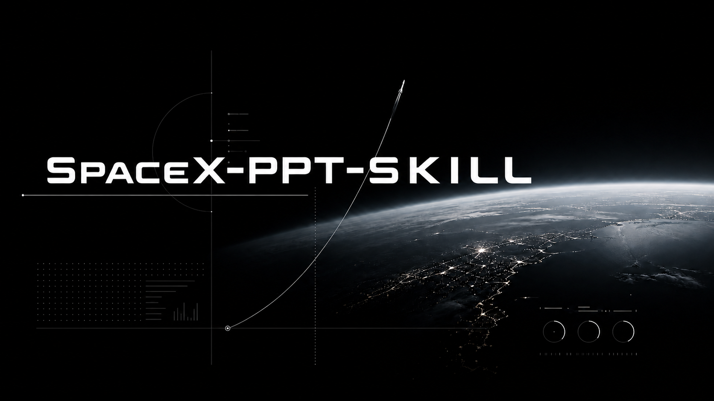

# spacex-ppt-skill



一个用于生成 **SpaceX 路演风格演示文稿** 的 AI Skill。

纯黑底色、全屏摄影、渐隐遮罩、轻量大写标题、克制的数据排版。适合把主题、提纲或散乱笔记快速整理成具有发布会质感的 PDF 幻灯片。

> Inspired by cinematic launch decks. Not affiliated with SpaceX.

## 适合做什么

- 商业计划书、路演稿、产品发布稿
- 科技、航天、能源、AI、硬件等偏未来感主题
- 极简黑色视觉系统的汇报或提案
- 从大纲生成 HTML 幻灯片，并导出 PDF 与逐页 PNG

## 目录结构

```text
spacex-ppt-skill/
├── README.md
├── docs/
│   └── images/readme-hero-final.png
└── spacex-ppt-skill/
    ├── SKILL.md
    ├── assets/
    │   ├── template.html
    │   ├── css/deck.css
    │   ├── fonts/
    │   └── images/
    ├── references/
    │   └── design_system.md
    └── scripts/
        ├── fetch_images.py
        ├── render_deck.py
        └── pexels_key.txt.example
```

## 安装

最简单的方式：把下面这句话发给你的智能体，让它自动安装：

```text
请从这个 GitHub 仓库安装这个 Skill：https://github.com/abxxvrv/spacex-ppt-skill 。只安装仓库中的 spacex-ppt-skill 子目录到我的本地 skills 目录，并确认其中的 SKILL.md 可以被正常发现。
```

如果你想手动安装，也可以复制文件夹：

把仓库中的 `spacex-ppt-skill/` 子目录复制到你的本地 skills 目录：

```text
~/.codex/skills/spacex-ppt-skill
```

Windows 通常是：

```text
C:\Users\<你的用户名>\.codex\skills\spacex-ppt-skill
```

安装后，向你的智能体提出类似请求即可触发：

```text
用 SpaceX 风格帮我做一份 AI 芯片创业公司的 10 页路演 PPT
```

## Pexels API Key

这个 Skill 会从 Pexels 获取统一风格的主题摄影。首次使用前需要配置自己的免费 API key：

1. 前往 `https://www.pexels.com/api/` 创建 key
2. 复制 `spacex-ppt-skill/scripts/pexels_key.txt.example`
3. 重命名为 `spacex-ppt-skill/scripts/pexels_key.txt`
4. 把你的 key 填进去

也可以使用环境变量：

```bash
export PEXELS_API_KEY="your-key-here"
```

真实的 `spacex-ppt-skill/scripts/pexels_key.txt` 已被 `.gitignore` 忽略，不要提交到 GitHub。

## 输出

默认输出为：

- `deck.pdf`，用于直接展示或发送
- `slide_*.png`，逐页图片
- `CREDITS.txt`，Pexels 图片署名信息

这个 Skill 追求像素级视觉控制，因此默认生成 HTML 幻灯片并渲染为 PDF/PNG，而不是可编辑的 `.pptx`。

## 使用建议

- 全套幻灯片只使用一个摄影主题
- 优先选择海岸、荒漠、山脉、夜空、冰川、航拍地貌等自然影像
- 少写字，多留白
- 避免彩色装饰、复杂边框和普通商务图库感

## 核心文件

- `spacex-ppt-skill/SKILL.md`：给智能体读取的技能说明
- `spacex-ppt-skill/references/design_system.md`：视觉规则和版式目录
- `spacex-ppt-skill/assets/template.html`：可复制的页面模板
- `spacex-ppt-skill/assets/css/deck.css`：完整视觉样式
- `spacex-ppt-skill/scripts/fetch_images.py`：获取并统一处理图片
- `spacex-ppt-skill/scripts/render_deck.py`：渲染 PDF 和 PNG
